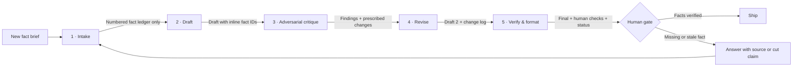

# Workflow diagram

## Handoff contract

| From | To | Required handoff | What is deliberately excluded |
|---|---|---|---|
| Input | Intake | Audience, purpose, facts, constraints, output format | Unstated background knowledge |
| Intake | Draft | Numbered fact ledger + open questions | Plausible guesses |
| Draft | Critique | Draft with inline `[F#]` citations + ledger | Clean copy that hides provenance |
| Critique | Revise | Unsupported/distorted/unclear/format findings | Vague “make it better” feedback |
| Revise | Verify | Draft 2 + change log + unresolved list | Silent edits |
| Verify | Human | Clean final + human-check list + coverage + status | Automatic publication |

